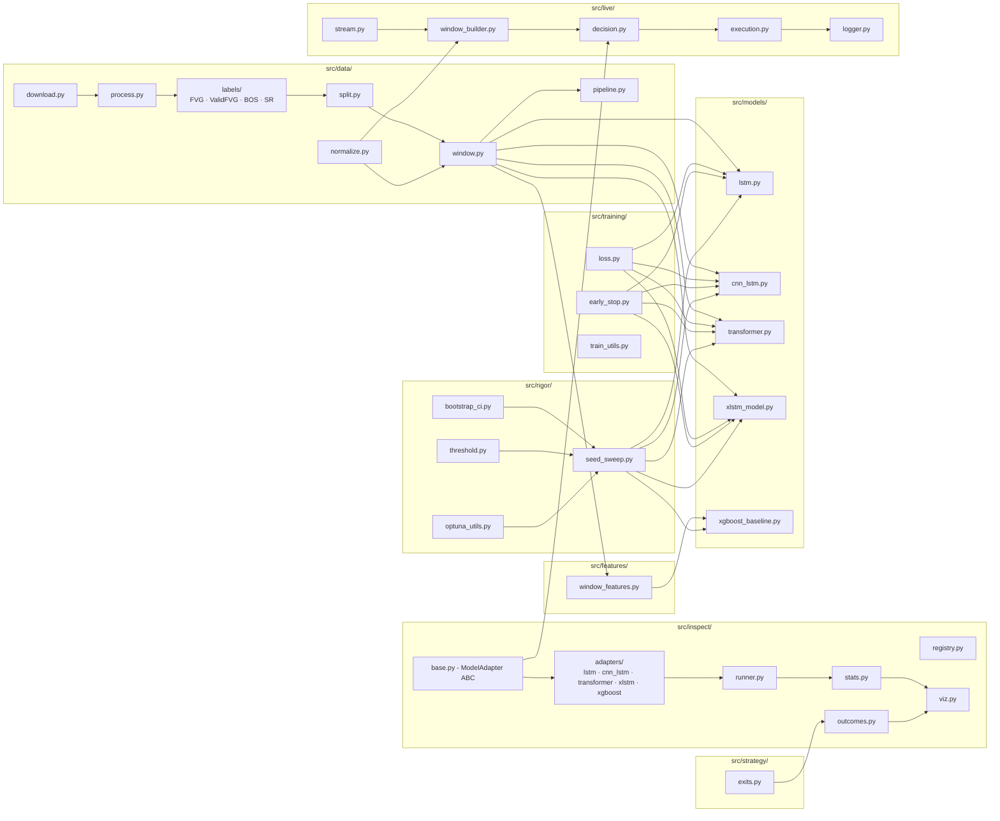
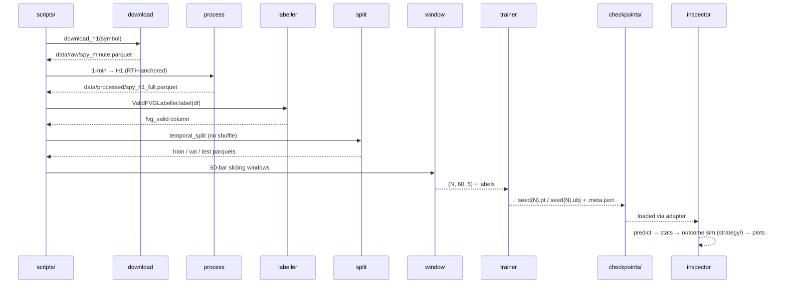
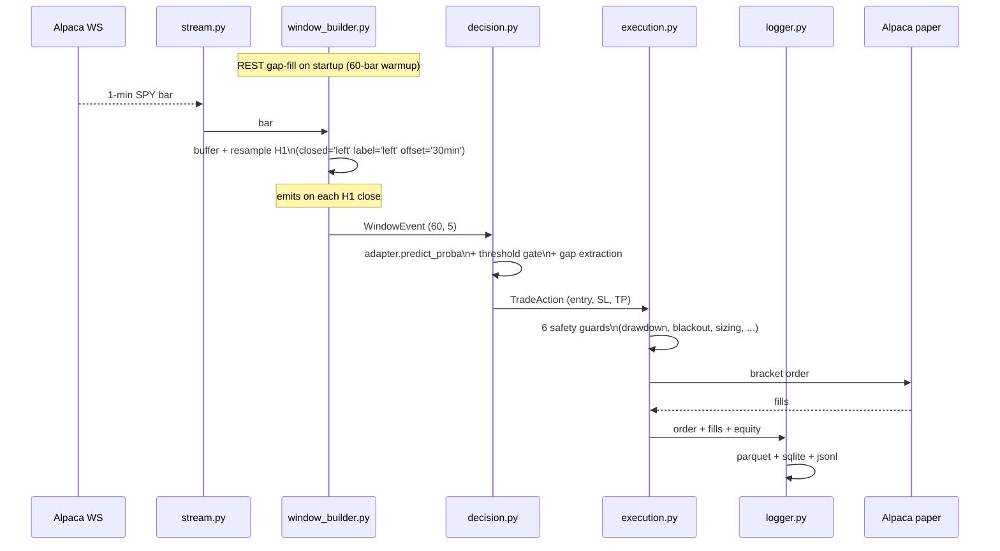

# Architecture

Developer-facing guide: what lives where, why each piece exists, and how data flows end-to-end. For data-pipeline specifics see [`docs/data.md`](data.md). For model results see [`docs/models.md`](models.md). For trade-simulation findings see [`docs/trading-simulation.md`](trading-simulation.md).

## Pipeline in plain language

1. **Acquire** - `src/data/download.py` pulls SPY 1-minute bars from Alpaca, stores them raw. `src/data/process.py` filters to regular trading hours (09:30-15:59 ET) and resamples to hourly bars. Other symbols (QQQ, IWM, DIA) follow the same path for multi-symbol runs.
2. **Label** - `src/data/labels/valid_fvg.py` walks the H1 bars and marks each candle with one of three classes: bullish FVG, bearish FVG, or none. Six geometric + structural criteria must all pass, the label is assigned at bar N+2 (the earliest bar where all criteria are knowable). This is the canonical training target.
3. **Split** - `src/data/split.py` cuts the labeled dataframe by date (train 2016-2021, val 2022, test 2023-2025). No shuffle. Boundaries are written to a provenance sidecar so splits can be reproduced exactly.
4. **Window** - `src/data/window.py` produces 60-bar sliding windows over each split. A cross-symbol leakage guard rejects any window that straddles two symbols, a session-gap helper prevents windows from spanning overnight breaks.
5. **Features / normalize** - `src/features/window_features.py` flattens a window to a feature vector for XGBoost. `src/data/normalize.py` does per-window z-score normalization for the DL models (used both offline and live).
6. **Train** - Scripts under `scripts/training/` call the models in `src/models/` with loss functions and early stopping from `src/training/`. Configs are loaded from experiment YAML files via `src/config/`.
7. **Evaluate / rigor** - `src/rigor/` provides the statistical machinery: multi-seed sweeps, Optuna HP search, threshold optimisation, bootstrap CIs. Scripts under `scripts/rigor/` drive these.
8. **Inspect** - `scripts/inspect_models.py` loads any checkpoint via `src/inspect/`, runs predictions on the test set, simulates trades through `src/strategy/exits.py`, and writes an HTML report.
9. **Live** - `scripts/paper_trade.py` connects to Alpaca's live WebSocket, builds H1 windows in real time via `src/live/`, and routes signals through the same decision + execution layer.

## Folder tree

```
smc-data-challenge/
├── data/                          # raw bars gitignored (regenerable); processed + gold tracked
│   ├── raw/spy_minute.parquet     # 1-min SPY bars from Alpaca (gitignored, ~188M)
│   ├── processed/                 # flat scheme: {scope}_{tf}_{split}.parquet + class_weights_{scope}_{tf}.json
│   │   ├── spy_h1_full.parquet               # H1 bars with fvg_valid + fvg label columns
│   │   ├── {spy,qqq,iwm,dia}_{h1,5m,15m}_{train,val,test}.parquet  # per-symbol temporal splits
│   │   ├── multisym_{h1,5m,15m}_{train,val,test}.parquet  # pooled 4-ticker splits
│   │   ├── class_weights_spy_h1.json        # SPY H1 inverse-frequency class weights
│   │   ├── class_weights_multisym_{h1,5m,15m}.json  # pooled inverse-frequency weights
│   │   ├── multisym_dataset_meta.json       # split metadata + per-symbol row counts
│   │   └── rawfvg/                           # raw-FVG label variant (historical baseline only)
│   └── gold_labels.csv            # human-annotated validation set
│
├── src/                           # all importable code
│   ├── data/                      # acquisition, labelling, splitting, windowing, pipeline
│   │   ├── download.py            # pulls raw 1-min bars from Alpaca for any symbol
│   │   ├── process.py             # 1-min → H1 via RTH filter + integrity checks
│   │   ├── normalize.py           # per-window z-score normalization; shared by offline + live paths
│   │   ├── split.py               # temporal split by date; writes provenance sidecar
│   │   ├── window.py              # 60-bar sliding windows; cross-symbol leakage guard; session-gap helper
│   │   ├── pipeline.py            # build_pipeline (SPY) + build_multi_symbol_pipeline orchestrators
│   │   ├── annotate.py            # gold-set sampler + Plotly window renderer for human review
│   │   └── labels/                # labeller package
│   │       ├── base.py            # BaseLabeller ABC + LABELLERS registry (plug-in pattern)
│   │       ├── fvg.py             # FVGLabeller, raw 3-candle geometry @ N+1 (historical baseline only)
│   │       ├── valid_fvg.py       # ValidFVGLabeller, 6-criteria SMC FVG @ N+2 (canonical target)
│   │       ├── bos.py             # Break-of-Structure detector (used by valid_fvg as one criterion)
│   │       └── sr.py              # Pivot S/R detector (used by valid_fvg as one criterion)
│   │
│   ├── features/                  # feature engineering for non-DL models
│   │   └── window_features.py     # flattens a 60×5 OHLCV window to a feature vector for XGBoost
│   │
│   ├── config/                    # experiment config, keeps training scripts free of hard-coded HP
│   │   ├── schema.py              # Pydantic v2 ExperimentConfig with nested model/train/data schemas
│   │   ├── loader.py              # load_config() - merges _base.yaml with override YAML
│   │   ├── registry.py            # ModelRegistry + LossRegistry (auto-discovered at import)
│   │   ├── _model_registrations.py # registers lstm, cnn_lstm, transformer, xlstm, xgb
│   │   └── _loss_registrations.py  # registers weighted_ce, focal
│   │
│   ├── models/                    # model architectures (all CPU-safe: MPS has gradient kernel bugs)
│   │   ├── lstm.py                # FVGLSTMClassifier, 2-layer unidirectional LSTM + FC head
│   │   ├── cnn_lstm.py            # FVGCNNLSTMClassifier, Conv1d feature extractor → LSTM → FC (carrier, best mean F1)
│   │   ├── transformer.py         # FVGTransformerClassifier, encoder stack + mean pooling; warmup + grad-clip required
│   │   ├── xlstm_model.py         # FVGxLSTMClassifier, sLSTM stack; v2 vanilla backend (arm64-safe)
│   │   └── xgboost_baseline.py    # XGBoost HP defaults; used by training scripts + inspect adapter
│   │
│   ├── strategy/                  # exit-strategy simulation - single source of truth for trade outcomes
│   │   └── exits.py               # ExitConfig + TradeOutcome + compute_exit: 4 strategies (fixed_2r,
│   │                              #   ict_iofed, ce_50pct, tradinglab), realism guards: ATR min-stop
│   │                              #   floor, slippage/commission costs, confidence filter, fill_mode
│   │
│   ├── training/                  # loss functions, early stopping, and seeding utilities
│   │   ├── loss.py                # WeightedCrossEntropy + FocalLoss (inverse-frequency weights loaded from JSON)
│   │   ├── early_stop.py          # EMA-smoothed patience, stops training when val F1 plateaus
│   │   └── train_utils.py         # global seed setter + device selection
│   │
│   ├── rigor/                     # statistical evaluation library (used by scripts/rigor/)
│   │   ├── seed_sweep.py          # multi-seed training loop: checkpoint-skip, arch-specific training
│   │   │                          #   routes (Transformer gets warmup+grad-clip, xLSTM gets neither)
│   │   ├── bootstrap_ci.py        # block bootstrap CIs: block size = window size to respect autocorrelation
│   │   ├── threshold.py           # per-class F1-optimal threshold search via PR curves
│   │   ├── optuna_utils.py        # Optuna objectives for LSTM + DL models; train/val only, test never touched
│   │   ├── optuna_xgb.py          # XGBoost Optuna objective kept separate so it can be imported without torch
│   │   │                          #   (torch import before XGBoost segfaults on macOS arm64)
│   │   └── report_utils.py        # Markdown + HTML report helpers shared across rigor scripts
│   │
│   ├── inspect/                   # offline model inspection toolkit
│   │   ├── base.py                # ModelAdapter ABC, shared contract for all model types
│   │   ├── registry.py            # walks adapters/ at import, one broken adapter does not block others
│   │   ├── runner.py              # runs one or more adapters over all test windows in a single pass
│   │   ├── stats.py               # computes per-class F1, confusion matrix, and inter-model agreement
│   │   ├── outcomes.py            # delegates to src/strategy.compute_exit; adds after-cost trade metrics
│   │   ├── viz.py                 # Plotly per-window candlestick + per-model prediction timeline
│   │   ├── report.py              # writes summary.md + HTML plots to reports/inspect/<timestamp>/
│   │   └── adapters/              # drop a file here, registry auto-discovers it as a new model
│   │       ├── lstm_adapter.py
│   │       ├── cnn_lstm_adapter.py
│   │       ├── transformer_adapter.py
│   │       ├── xlstm_adapter.py
│   │       ├── xgboost_adapter.py
│   │       └── _xgb_worker.py     # runs XGBoost inference in a subprocess to avoid torch-fork segfault
│   │
│   └── live/                      # live paper-trading harness
│       ├── stream.py              # opens Alpaca WebSocket and emits 1-min bars
│       ├── window_builder.py      # buffers 1-min bars, resamples to RTH-anchored H1, emits 60-bar windows
│       ├── decision.py            # applies model threshold, extracts FVG gap bounds to TradeAction
│       ├── execution.py           # submits bracket orders via Alpaca paper API, 6 safety guards
│       ├── slippage.py            # adds 1-tick slippage overlay for honest P&L accounting
│       ├── logger.py              # writes bars (parquet), trades (sqlite), events (jsonl) per session
│       └── replay.py              # replays a logged session deterministically for debugging
│
├── demo/                          # presentation demo backend (builds the offline FVG-replay HTML)
│   ├── predict.py                 # reuses inspect runner/outcomes/multisym to get per-model trades
│   ├── serialize.py               # build_demo_payload + build_multi_scene_payload (JSON for the JS driver)
│   ├── render.py                  # inlines vendored ECharts + payload into one self-contained HTML
│   └── templates/demo.html        # ECharts multi-grid animated bar-by-bar replay + scene picker
│
├── scripts/                       # CLI entry points (not imported by src/)
│   ├── data/                      # one-off data utilities
│   │   ├── annotate_gold_set.py   # interactive Plotly tool for building the gold validation set
│   │   ├── count_valid_fvg.py     # sparsity gate, prints positive rates for current ValidFVGLabeller config
│   │   └── depth_probe.py         # multi-symbol readiness check (D9 gate)
│   ├── training/                  # model training entry points
│   │   ├── train_xgboost.py       # trains XGBoost on windowed features, saves checkpoint
│   │   ├── train_lstm.py          # trains LSTM (CPU-only), saves checkpoint
│   │   ├── train_cnn_lstm.py      # trains CNN-LSTM (CPU-only), saves checkpoint
│   │   └── train.py               # generic YAML-driven trainer, works for any registered model
│   └── rigor/                     # statistical rigour tools, grouped by purpose
│       ├── tune/                  # Optuna HP search (train + val only, test never loaded)
│       │   ├── tune_lstm.py
│       │   ├── tune_cnn_lstm.py
│       │   ├── tune_transformer.py    # warmup + grad-clip gated to this arch only
│       │   └── tune_xgboost.py        # subprocess workers for arm64 safety
│       ├── sweeps/                # parametric sweeps
│       │   ├── threshold_sweep.py        # F1-optimal thresholds per class (single seed)
│       │   ├── threshold_multiseed.py    # threshold sweep over 5 seeds
│       │   ├── window_sweep.py           # val F1 vs window size
│       │   └── learning_curve.py         # val F1 vs train fraction; shells to train.py
│       ├── stats/                 # statistical validation, metrics, baselines
│       │   ├── bootstrap_ci.py           # block bootstrap CIs, single seed
│       │   ├── bootstrap_ci_multiseed.py # block bootstrap CIs over all 5 seeds
│       │   ├── asymmetry_analysis.py     # bull vs bear FVG class asymmetry
│       │   ├── shap_xgb.py               # SHAP feature importance for XGBoost checkpoint
│       │   ├── naive_baselines.py        # majority-class + random floor (single-label, TF-aware)
│       │   ├── naive_baselines_dual.py   # majority-class + random floor (ValidFVG + raw FVG)
│       │   └── dual_fvg_compare.py       # side-by-side raw-FVG vs ValidFVG report
│       ├── eval/                  # holdout eval + multi-seed orchestration
│       │   ├── multiseed_run.py          # drives seed_sweep for any model via YAML
│       │   └── eval_spy_test.py          # scores multisym checkpoints on fixed SPY-only test
│       ├── pipelines/             # shell orchestrators
│       │   ├── run_dl_diagnosis_pipeline.sh      # full DL ladder + learning-curve jobs
│       │   └── transformer_fairshot_pipeline.sh  # tuned-Transformer fair-shot
│       └── _workers/              # subprocess workers, isolate XGBoost/SHAP from torch (arm64 segfault)
│           ├── _xgb_sweep_worker.py
│           ├── _xgb_tune_worker.py
│           ├── _xgb_eval_spy_worker.py
│           └── _shap_worker.py
│   ├── inspect_models.py          # offline inspector CLI: loads checkpoints, runs stats + trade-sim, writes report
│   └── paper_trade.py             # live paper trader: one process per model, connects to Alpaca WS
│
├── notebooks/                     # CRISP-DM presentation notebooks (read-only reference)
│   ├── 00-introduction.ipynb
│   ├── 01-data-understanding.ipynb
│   ├── 02-gold-annotation.ipynb
│   ├── 03-baselines.ipynb
│   ├── 04-status-update-1.ipynb   # + .html rendered export
│   ├── 05-presentation.ipynb      # + .slides.html
│   ├── 06-status-update-2.ipynb   # + .html rendered export
│   └── 07-status-update-2-presentation.ipynb  # + .slides.html
│
├── tests/                         # pytest - mirrors src/ layout (about 1092 tests, zero skips)
│   ├── data/                      # pipeline, labels, windowing, lookahead assertion fixture
│   ├── models/                    # per-arch forward-pass smoke tests
│   ├── training/                  # loss, early stop, seeding
│   ├── config/                    # schema validation, registry, loader
│   ├── rigor/                     # seed_sweep, bootstrap, threshold, TF routing
│   ├── inspect/                   # adapter, registry, runner, stats
│   ├── strategy/                  # FVG exit strategies, realism guards
│   ├── features/                  # window feature extraction
│   ├── live/                      # stream, window_builder, decision, executor, fleet
│   └── demo/                      # serialize payload + predict track tests
│
├── checkpoints/                   # trained weights (gitignored)
│   └── {arch}_{tf}_{dataset}[_tuned]/   # e.g. cnn_lstm_h1_spy/, xgboost_h1_multisym/, cnn_lstm_15m_multisym_tuned/
│       ├── {arch}_seed{N}.pt + .meta.json     # torch models
│       └── xgb_seed{N}.ubj + .meta.json       # XGBoost
│
├── logs/                          # paper-trading session logs (gitignored)
│   └── paper/<session-id>/{bars.parquet, events.jsonl, trades.sqlite}
│
├── reports/                       # inspector HTML output + rigor artifacts (gitignored)
│   ├── inspect/<timestamp>/{summary.md, plots/}
│   └── rigor/<date>/<topic>.{md,json}
│
└── docs/                          # project documentation
    ├── overview.md                # plain-language project overview
    ├── architecture.md            # this file
    ├── data.md                    # data pipeline, labelling, splits in detail
    ├── models.md                  # per-model cards + current benchmark results
    ├── evaluation.md              # fairness, leakage guards, CIs, validation sprint
    ├── trading-simulation.md      # trade-sim methodology + realism findings
```

## High-level component map



## Offline data flow



## Live data flow



## Key engineering decisions

**Temporal split only** - the dataset is a time series. Shuffling would let future bars leak into training. Boundaries (2021/2022/2025) are fixed in `src/data/split.py` and written to a provenance sidecar so they cannot drift between runs.

**CPU-only training** - PyTorch MPS (Apple Silicon GPU) has a gradient kernel bug that silently corrupts LSTM/CNN-LSTM backward passes on torch 2.x. All experiment YAMLs set `device: cpu`.

**XGBoost subprocess isolation** - importing torch before XGBoost in the same process segfaults on macOS arm64 after Python 3.11. Tuning and SHAP workers run in subprocesses that import XGBoost without ever loading torch. The XGBoost test file is also run in a separate pytest invocation for the same reason.

**Single-source exit logic** - `src/strategy/exits.py` is the only place that computes trade outcomes. `src/inspect/outcomes.py` (offline) and `src/live/execution.py` (live) both delegate to it. This prevents the offline and live P&L calculations from diverging.

**Cross-symbol leakage guard** - `src/data/window.py` rejects any 60-bar window that contains bars from more than one symbol. This matters in multi-symbol pooled datasets where symbol transitions can appear mid-sequence after sorting by timestamp.

**No lookahead in labels** - `ValidFVGLabeller` assigns its label at bar N+2, the earliest bar where all six criteria (including partial fill check) are knowable. A mandatory pytest fixture asserts this on every labeller in the registry.

## Scripts reference

### Data utilities (`scripts/data/`)

| Script | What it does |
|--------|--------------|
| `annotate_gold_set.py` | Interactive Plotly tool, analyst marks each window as TP/FP/FN to build `gold_labels.csv` |
| `count_valid_fvg.py` | Prints positive-rate breakdown for the current `ValidFVGLabeller` config - used as a sparsity gate before training |
| `depth_probe.py` | Multi-symbol readiness check: verifies all symbols have enough history before a pooled-pipeline run |

### Training (`scripts/training/`)

| Script | What it does |
|--------|--------------|
| `train_xgboost.py` | Trains XGBoost on windowed features, saves `xgb_seed42.ubj` + meta |
| `train_lstm.py` | Trains LSTM (CPU-only), saves `lstm_seed42.pt` + meta |
| `train_cnn_lstm.py` | Trains CNN-LSTM (CPU-only), saves checkpoint + meta |
| `train.py` | Generic YAML-driven trainer - reads an experiment config and trains whichever model is registered there |

### Rigor sprint tools (`scripts/rigor/`)

Grouped into subdirs: `tune/`, `sweeps/`, `stats/`, `eval/`, `pipelines/`, `_workers/`.

| Script | What it does |
|--------|--------------|
| `multiseed_run.py` | Drives `src/rigor/seed_sweep` for any model via YAML; `_sort_if_multisym` guard ensures symbol ordering |
| `learning_curve.py` | Shells to `train.py` for each (fraction, seed) pair and plots val F1 vs training data size |
| `tune_lstm.py` | Optuna HP search for LSTM, train+val only, test never loaded |
| `tune_xgboost.py` | Optuna HP search for XGBoost via subprocess workers |
| `tune_cnn_lstm.py` | Optuna HP search for CNN-LSTM |
| `tune_transformer.py` | Optuna HP search for Transformer, warmup + grad-clip gated to this arch only |
| `threshold_sweep.py` | Finds F1-maximising decision thresholds per class (single seed) |
| `threshold_multiseed.py` | Threshold sweep aggregated across all 5 seeds |
| `window_sweep.py` | Val F1 vs window size sensitivity analysis |
| `asymmetry_analysis.py` | Bull vs bear FVG asymmetry - checks whether one direction is systematically easier |
| `bootstrap_ci.py` | Block bootstrap confidence intervals from a single seed's predictions |
| `bootstrap_ci_multiseed.py` | Block bootstrap CIs aggregated over all 5 seeds |
| `shap_xgb.py` | SHAP feature importance for an XGBoost checkpoint (subprocess for arm64 safety) |
| `naive_baselines.py` | Majority-class and uniform-random F1 floor (single-label, TF-aware) |
| `naive_baselines_dual.py` | Majority-class and uniform-random F1 floor for both label sets (ValidFVG + raw FVG) |
| `dual_fvg_compare.py` | Side-by-side raw-FVG vs ValidFVG comparison report from checkpoint meta files |
| `eval_spy_test.py` | Scores multi-symbol checkpoints on the fixed SPY-only test set for apples-to-apples comparison |
| `run_dl_diagnosis_pipeline.sh` | Shell orchestrator: runs the full DL ladder + learning-curve jobs in background |
| `transformer_fairshot_pipeline.sh` | Tuned-Transformer fair-shot pipeline: HP sweep + 5-seed run + collapse probe |

### Main CLIs

| Script | What it does |
|--------|--------------|
| `scripts/inspect_models.py` | Loads one or more checkpoints, runs test-set inference, simulates exits via `src/strategy`, writes HTML report. Supports `name:path` checkpoint syntax, `--all-exit-strategies`, `--realistic`, `--all-seeds`, `--confidence-sweep`. |
| `scripts/paper_trade.py` | Connects to Alpaca WebSocket, builds H1 windows in real time, and paper-trades via bracket orders. Run one process per model. |
| `scripts/demo_animator.py` | Builds the presentation demo: a self-contained offline ECharts HTML replaying held-out SPY windows bar-by-bar across all four H1 models, with held/failed/no-outcome badges, a per-model stats box, and a 4-scene picker. Writes `reports/demo/fvg_animation.html`. |

## Tools and external services

| Tool | Where used | Purpose |
|------|------------|---------|
| `alpaca-py` | `src/data/download.py`, `src/live/stream.py`, `src/live/execution.py` | Historical 1-min bars, live WebSocket, paper bracket orders |
| `exchange_calendars` | `src/data/process.py`, `src/live/window_builder.py` | NYSE schedule - half-day and holiday detection |
| `torch` | `src/models/{lstm,cnn_lstm,transformer,xlstm_model}.py`, matching adapters | DL model training and inference (CPU-only) |
| `xgboost` | `src/models/xgboost_baseline.py`, `src/inspect/adapters/_xgb_worker.py` | Gradient boosting baseline and inference |
| `optuna` | `src/rigor/optuna_utils.py`, `src/rigor/optuna_xgb.py` | Hyperparameter search |
| `plotly` | `src/data/annotate.py`, `src/inspect/viz.py` | Candlestick charts and prediction overlays |
| `sklearn` | `src/inspect/stats.py`, training scripts | F1, confusion matrix, PR curves |
| `pytest` | `tests/` | Unit and integration tests |

## Where artifacts land

| Artifact | Path |
|----------|------|
| Trained weights | `checkpoints/{arch}_{tf}_{dataset}[_tuned]/{arch}_seed{N}.pt` (torch) or `xgb_seed{N}.ubj` (XGBoost) + matching `.meta.json` |
| Inspector report | `reports/inspect/<timestamp>/summary.md` + `plots/*.html` |
| Presentation demo | `reports/demo/fvg_animation.html` (self-contained offline ECharts replay) |
| Rigor outputs | `reports/rigor/<date>/<topic>.{md,json}` |
| Live session log | `logs/paper/<session-id>/{bars.parquet, events.jsonl, trades.sqlite}` |
