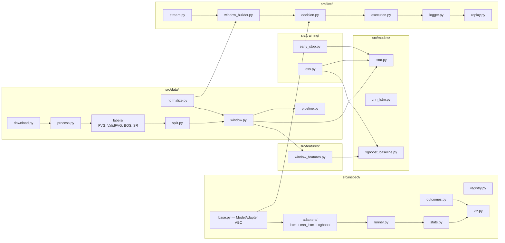
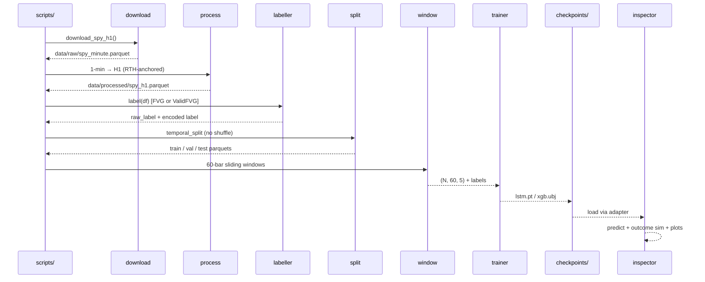
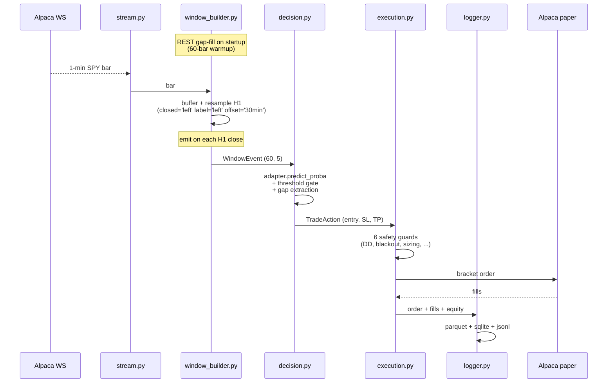

# Code Structure

What lives where + which script does what.

## Folder tree

```
smc-data-challenge/
├── data/                          # all on-disk data (gitignored except .gitkeep + gold)
│   ├── raw/spy_minute.parquet     # 1-min SPY bars from Alpaca
│   ├── processed/                 # H1 + splits + class weights
│   │   ├── spy_h1.parquet          # H1 bars with fvg_valid + fvg label columns
│   │   ├── spy_h1_{train,val,test}.parquet  # 2016–2021/2022/2023–2025 temporal split
│   │   ├── class_weights.json      # alias for class_weights_fvg_valid.json
│   │   └── class_weights_fvg_valid.json
│   └── gold_labels.csv            # human-annotated validation set
│
├── src/                           # all importable code
│   ├── data/                      # acquisition, labelling, splitting, windowing
│   │   ├── download.py            # Alpaca SDK → raw parquet
│   │   ├── process.py             # 1-min → H1, RTH filter, integrity checks
│   │   ├── normalize.py           # per-window min-max (used live + offline)
│   │   ├── split.py               # temporal split, no shuffle
│   │   ├── window.py              # 60-bar sliding windows + session gap helper
│   │   ├── pipeline.py            # build_pipeline orchestrator
│   │   ├── annotate.py            # gold-set sampler + Plotly window renderer
│   │   └── labels/                # labeller package
│   │       ├── base.py            # BaseLabeller ABC + LABELLERS registry
│   │       ├── fvg.py             # FVGLabeller — raw 3-candle geometry @ N+1
│   │       ├── valid_fvg.py       # ValidFVGLabeller — 6-criteria SMC @ N+2
│   │       ├── bos.py             # Break-of-Structure detector (used by valid_fvg)
│   │       └── sr.py              # Pivot S/R detector (used by valid_fvg)
│   │
│   ├── features/                  # feature engineering for non-DL
│   │   └── window_features.py     # 60×5 window → feature vector for XGBoost
│   │
│   ├── config/                    # Pydantic v2 experiment config + YAML loader
│   │   ├── schema.py              # ExperimentConfig + nested model/train/data schemas
│   │   ├── loader.py              # load_config() — merges _base.yaml + override YAML
│   │   ├── registry.py            # ModelRegistry + LossRegistry (auto-discovered)
│   │   ├── _model_registrations.py # registers lstm, cnn_lstm, transformer, xlstm, xgb
│   │   └── _loss_registrations.py  # registers weighted_ce, focal
│   │
│   ├── models/                    # model architectures
│   │   ├── lstm.py                # FVGLSTMClassifier (2-layer unidir, CPU-only)
│   │   ├── cnn_lstm.py            # FVGCNNLSTMClassifier (Conv1d → LSTM → FC, CPU-only) — carrier
│   │   ├── transformer.py        # FVGTransformerClassifier (encoder + pooling, CPU-only, untuned)
│   │   ├── xlstm_model.py        # FVGxLSTMClassifier (sLSTM stack, v2 API vanilla backend, CPU-only, untuned)
│   │   └── xgboost_baseline.py    # GBM hyperparameter defaults
│   │
│   ├── training/                  # loss + optim + early stop
│   │   ├── loss.py                # WeightedCE, FocalLoss
│   │   ├── early_stop.py          # EMA-smoothed patience
│   │   └── train_utils.py         # seeding, device pick
│   │
│   ├── inspect/                   # offline model inspection toolkit
│   │   ├── base.py                # ModelAdapter ABC (shared with src/live)
│   │   ├── registry.py            # pkg-walks adapters/ and registers
│   │   ├── runner.py              # multi-adapter inference over windows
│   │   ├── stats.py               # F1, confusion, agreement
│   │   ├── outcomes.py            # TP/SL/undecided walk over future bars
│   │   ├── viz.py                 # Plotly per-window + per-model timeline
│   │   ├── report.py              # writes summary.md + HTML plots
│   │   └── adapters/              # drop a file here = new model auto-discovered
│   │       ├── lstm_adapter.py
│   │       ├── cnn_lstm_adapter.py
│   │       ├── xgboost_adapter.py
│   │       └── _xgb_worker.py     # subprocess for Python 3.14+ segfault workaround
│   │
│   └── live/                      # live paper-trading harness
│       ├── stream.py              # AlpacaBarStream (WebSocket 1-min)
│       ├── window_builder.py      # 1-min → RTH-anchored H1, emits 60-bar windows
│       ├── decision.py            # SingleModelDecision (threshold + gap extraction)
│       ├── execution.py           # PaperExecutor (bracket orders + safety guards)
│       ├── slippage.py            # 1-tick overlay for honest P&L
│       ├── logger.py              # parquet bars + sqlite trades + jsonl events
│       └── replay.py              # deterministic session replay for debug
│
├── scripts/                       # CLI entry points
│   ├── data/                      # data utilities
│   │   ├── annotate_gold_set.py   # interactive Plotly gold-set annotation
│   │   ├── count_valid_fvg.py     # sparsity gate for ValidFVGLabeller tuning
│   │   └── persist_labels.py      # deprecated — exits 0 with notice (labels now in spy_h1.parquet)
│   ├── training/                  # model training
│   │   ├── train_lstm.py          # train + save LSTM
│   │   ├── train_cnn_lstm.py      # train + save CNN-LSTM
│   │   ├── train_xgboost.py       # train + save XGBoost
│   │   └── train.py               # generic YAML-driven trainer (all models)
│   ├── rigor/                     # rigor sprint tools (tuning, analysis)
│   │   ├── multiseed_run.py       # multi-seed sweep + focal ablation (YAML-driven)
│   │   ├── tune_lstm.py           # Optuna HP search for LSTM
│   │   ├── tune_xgboost.py        # Optuna HP search for XGBoost
│   │   ├── tune_cnn_lstm.py       # Optuna HP search for CNN-LSTM
│   │   ├── threshold_sweep.py     # per-class F1-optimal thresholds
│   │   ├── threshold_multiseed.py # threshold sweep across all 5 seeds
│   │   ├── window_sweep.py        # window size sensitivity analysis
│   │   ├── asymmetry_analysis.py  # bull vs bear asymmetry (Gap 6)
│   │   ├── bootstrap_ci.py        # block bootstrap confidence intervals (Gap 10, single seed)
│   │   ├── bootstrap_ci_multiseed.py # bootstrap CI aggregated over 5 seeds
│   │   ├── naive_baselines.py     # majority-class + uniform-random baselines
│   │   ├── shap_xgb.py            # SHAP feature importance (Gap 5)
│   │   └── _workers/              # subprocess workers (Python 3.14 segfault workaround)
│   │       ├── _xgb_sweep_worker.py
│   │       ├── _xgb_tune_worker.py
│   │       └── _shap_worker.py
│   ├── inspect_models.py          # offline inspector CLI
│   └── paper_trade.py             # live paper trader CLI
│
├── notebooks/                     # CRISP-DM presentation notebooks
│   ├── 01-data-understanding.ipynb
│   └── 02-gold-annotation.ipynb
│
├── tests/                         # pytest — mirrors src/ layout
│   ├── data/                      # pipeline, labels, windowing
│   ├── inspect/                   # adapter, registry, runner, stats
│   └── live/                      # stream, window builder, decision, executor
│
├── checkpoints/                   # trained weights (gitignored)
│   ├── lstm/lstm_seed42.pt
│   └── xgboost/xgb_seed42.ubj
│
├── logs/                          # paper-trading session logs (gitignored)
│   └── paper/<session-id>/{bars.parquet, events.jsonl, trades.sqlite}
│
├── reports/                       # inspector HTML output (gitignored)
│   └── inspect/<timestamp>/{summary.md, plots/}
│
├── docs/                          # this directory
├── .nb/                     # research/plan/build logs
└── CLAUDE.md                      # project rules for AI assistance
```

## High-level component map



## Offline data flow (training + inspection)



## Live data flow (paper trading)



## Scripts — what each does

### Data utilities (`scripts/data/`)

| Script | Purpose | Typical command |
|--------|---------|-----------------|
| `persist_labels.py` | **Deprecated** — labels are now embedded in `spy_h1.parquet` via pipeline. Script exits 0 with a notice. | — |
| `count_valid_fvg.py` | Sparsity gate — count positives produced by current `ValidFVGLabeller` config | `python scripts/data/count_valid_fvg.py` |
| `annotate_gold_set.py` | Interactive Plotly annotation of gold validation set | `python scripts/data/annotate_gold_set.py` |

### Training (`scripts/training/`)

| Script | Purpose | Typical command |
|--------|---------|-----------------|
| `train_xgboost.py` | Train XGBoost on windowed features | `python scripts/training/train_xgboost.py` |
| `train_lstm.py` | Train LSTM (CPU-only) | `python scripts/training/train_lstm.py` |
| `train_cnn_lstm.py` | Train CNN-LSTM (CPU-only) | `python scripts/training/train_cnn_lstm.py` |
| `train.py` | Generic YAML-driven trainer for any registered model | `python scripts/training/train.py --config experiments/cnn_lstm_g1.yaml` |

### Rigor sprint tools (`scripts/rigor/`)

| Script | Purpose | Typical command |
|--------|---------|-----------------|
| `multiseed_run.py` | Multi-seed training sweep (YAML-driven, any model incl. transformer/xlstm) | `python scripts/rigor/multiseed_run.py --model cnn_lstm --config experiments/cnn_lstm_g1.yaml --set 'train.seeds=[0,17,42,123,2024]' --output-dir reports/rigor/<ts>/` |
| `learning_curve.py` | Data-efficiency learning curve (val F1 vs train fraction, any arch); A2b guard asserts `--train-fraction` honoured | `python scripts/rigor/learning_curve.py --model cnn_lstm --config experiments/cnn_lstm_g1.yaml --fractions 0.2 0.4 0.6 0.8 1.0 --seeds 42 17 0` |
| `run_dl_diagnosis_pipeline.sh` | Orchestrates the full DL ladder + learning-curve diagnosis (background, CPU) | `bash scripts/rigor/run_dl_diagnosis_pipeline.sh` |
| `tune_lstm.py` | Optuna HP search for LSTM | `python scripts/rigor/tune_lstm.py --n-trials 50` |
| `tune_xgboost.py` | Optuna HP search for XGBoost | `python scripts/rigor/tune_xgboost.py --n-trials 50` |
| `tune_cnn_lstm.py` | Optuna HP search for CNN-LSTM | `python scripts/rigor/tune_cnn_lstm.py --n-trials 12 --timeout 3600` |
| `threshold_sweep.py` | Per-class F1-optimal threshold tuning (single seed) | `python scripts/rigor/threshold_sweep.py --model-path <checkpoint> --model-type lstm` |
| `threshold_multiseed.py` | Threshold sweep aggregated over 5 seeds | `python scripts/rigor/threshold_multiseed.py --config experiments/cnn_lstm_g1.yaml` |
| `window_sweep.py` | Window size sensitivity analysis | `python scripts/rigor/window_sweep.py --config <config.yaml> --windows 30 60 90 120` |
| `asymmetry_analysis.py` | Bull vs Bear FVG asymmetry analysis (Gap 6) | `python scripts/rigor/asymmetry_analysis.py --pred-dir reports/rigor/<ts>/` |
| `bootstrap_ci.py` | Block bootstrap CI (single-seed predictions) | `python scripts/rigor/bootstrap_ci.py --predictions <preds.npz>` |
| `bootstrap_ci_multiseed.py` | Block bootstrap CI aggregated over 5 seeds | `python scripts/rigor/bootstrap_ci_multiseed.py --config experiments/cnn_lstm_g1.yaml` |
| `naive_baselines.py` | Majority-class and uniform-random baselines | `python scripts/rigor/naive_baselines.py` |
| `shap_xgb.py` | SHAP feature importance analysis (Gap 5) | `python scripts/rigor/shap_xgb.py --checkpoint <model.ubj>` |

### Main CLIs (`scripts/`)

| Script | Purpose | Typical command |
|--------|---------|-----------------|
| `inspect_models.py` | Offline model inspection on test set with TP/SL outcome simulation | `python scripts/inspect_models.py --models lstm xgboost --lookahead-bars 20` |
| `paper_trade.py` | Live paper trading via Alpaca (one process per model) | `python scripts/paper_trade.py --model lstm:checkpoints/lstm/lstm_seed42.pt --session lstm-001` |

## Tools / external services

| Tool | Where used | Purpose |
|------|------------|---------|
| `alpaca-py` | `src/data/download.py`, `src/live/stream.py`, `src/live/execution.py` | Historical 1-min bars + live WebSocket + paper bracket orders |
| `exchange_calendars` | `src/data/process.py`, `src/live/window_builder.py` | NYSE schedule, half-day + holiday detection |
| `torch` | `src/models/lstm.py`, `src/models/cnn_lstm.py`, `src/inspect/adapters/lstm_adapter.py`, `src/inspect/adapters/cnn_lstm_adapter.py` | LSTM + CNN-LSTM training + inference |
| `xgboost` | `src/models/xgboost_baseline.py`, `src/inspect/adapters/_xgb_worker.py` | Gradient boosting baseline |
| `plotly` | `src/data/annotate.py`, `src/inspect/viz.py` | Candlestick visualisation |
| `sklearn` | `src/inspect/stats.py`, `scripts/training/train_xgboost.py` | F1, confusion, train utils |
| `pytest` | `tests/` | All unit + integration tests |

## Where artifacts land

| Artifact | Path |
|----------|------|
| Trained weights | `checkpoints/<model>/<name>.{pt,ubj}` + matching `.meta.json` |
| Inspector report | `reports/inspect/<timestamp>/summary.md` + `plots/*.html` |
| Live session log | `logs/paper/<session-id>/{bars.parquet, events.jsonl, trades.sqlite}` |
| Research / plans / build logs | `.nb/{research,plan,build}/<date>/<topic>.md` |
| Docs | `docs/` (this directory) |
