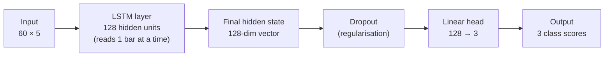
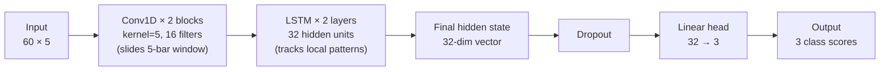
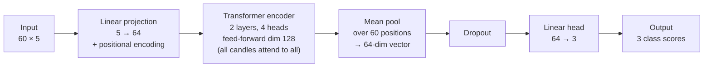
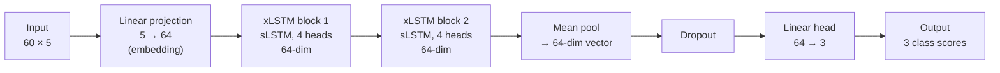

# Models: SMC FVG Detector

**Last updated:** 13-Jun-26
**Label target:** ValidFVGLabeller ("fvg_valid"), 6-criteria SMC Fair Value Gap, ~3% positive rate
**Test set:** SPY H1 2023-2025 (5,257 bars, fixed holdout, never used during training)
**Metric:** macro-averaged F1 across the three classes (none / bull-FVG / bear-FVG)

---

## Why F1, not accuracy

The label distribution is roughly 97% none, 1.8% bull-FVG, 1.3% bear-FVG. A model that
predicts "no pattern" for every bar scores ~97% accuracy while being completely useless.
F1 on the rare FVG classes is the only metric that shows whether the model actually finds
the patterns we care about. All numbers below are macro-F1 (average of all three classes).

---

## The five models

Each model was evaluated on the same holdout set, 5 random seeds, with 95% bootstrap
confidence intervals (re-sampling the results many times to get an honest range rather than one number; 1,000 resamples, block size 60, effective_n = 86).

### XGBoost (gradient boosting)

A gradient-boosting model that builds many small decision trees, each correcting the errors
of the previous one. It is strong on small tabular datasets and is used here as the mandatory
control baseline. It does not consume raw price bars; it receives 35 hand-engineered
features (momentum, gap geometry, volatility ratios) computed from the same 60-bar window.
This input advantage must be kept in mind when comparing it to the neural nets, which all
take raw OHLCV windows. The lead over the best neural net is partly representation, not
pure architecture.

**SPY-only result (5 seeds):** 0.721 ± 0.001, 95% CI [0.671, 0.761]
**Multi-symbol result:** 0.738 [0.689, 0.779] (+0.017, statistically tied with baseline)

---

### LSTM (Long Short-Term Memory network)

A recurrent neural network that processes bars one at a time and maintains a memory cell,
allowing it to learn that events earlier in the 60-bar window matter for the current
prediction. It is the natural first deep-learning candidate for sequential data like
candlestick charts. Input: raw (60, 5) OHLCV windows, no hand-engineering.

Architecture: 1-layer unidirectional LSTM, 128 hidden units, ~120k parameters.
HP: Optuna (a tool that automatically tries many settings to find the best) tuned (38 complete + 38 pruned trials, best val F1 0.637 at trial 42). HP = hyperparameters: the model settings you choose before training begins, for example how many layers or how fast the model learns.

**SPY-only result (5 seeds):** 0.595 ± 0.015, 95% CI [0.560, 0.628]
**Multi-symbol result:** 0.640 [0.604, 0.677] (+0.045, statistically tied; CI overlaps, point estimate up)

Diagnosis: data + regularisation-bound. Train F1 reaches 0.93-0.95 (fits well), but the 0.35 train/val gap is the largest in the ladder. The learning curve (a plot of score versus amount of training data) shows no plateau through full data. More data is the indicated lever.

---

### CNN-LSTM (Convolutional + LSTM network): carrier / deliverable (the model chosen to carry forward as the final deliverable)

A hybrid that runs two convolutional layers over the 60-bar window first, learning to
detect local shape patterns (for example, the 3-candle FVG geometry), then feeds those
pattern activations into a 2-layer LSTM to capture sequence context. This inductive bias
(the assumptions a model is built with: here, "nearby candles form local shapes that matter") means a local pattern detector feeding into a sequence model, which is a natural match for candlestick
patterns. Same raw (60, 5) input as all DL models.

Architecture: 2x Conv1d(5->16, kernel=5) + BatchNorm + ReLU -> 2-layer LSTM(16->32) ->
FC(32->3), ~29k parameters.
HP: Optuna tuned (6 complete trials, 60-min cap, best val F1 0.644).

**SPY-only result (5 seeds):** 0.639 ± 0.013, 95% CI [0.603, 0.674]
**Multi-symbol result:** 0.675 [0.637, 0.710] (+0.036)

Multi-symbol mean 0.675 clears the pre-registered 0.674 threshold (the upper bound of the
SPY-only 95% CI). All 5 seeds improved (range 0.666-0.683, std 0.005). Bear-FVG F1 rose
from 0.439 to 0.505 (+0.066). The CI lower (0.637) falls 0.002 below the baseline point
(0.639). At strict 95% confidence the improvement is not unambiguous given the 86-block
test set, but the per-seed consistency and the bear_f1 gain make the signal real.

Diagnosis: data + regularisation-bound. Train F1 0.81-0.89 (fits well, no plateau through
full data). The multi-symbol experiment confirmed this: adding three more symbols multiplied
the rare bull/bear positives by approximately 4x and produced the cleanest gain across all models.

**This is the chosen deliverable carrier**, highest fair-input DL F1, tightest seed
variance, no learning-curve plateau, and the most consistent response to more data.

---

### Transformer (self-attention network)

A model that learns relationships between every pair of bars in the 60-bar window
simultaneously, rather than processing them sequentially. It does not assume that nearby
bars are more relevant, every bar can attend to every other bar. On large datasets this
flexibility is a strength; on small datasets it becomes fragility. Same raw (60, 5) input.

Note: this model was not Optuna-tuned (unlike XGBoost, LSTM, and CNN-LSTM). The result is
an untuned baseline, so the number is a lower bound, not a tuned verdict. The Transformer
was de-prioritised for tuning because its primary problem is instability (see below), not
hyperparameter sub-optimality.

**SPY-only result (5 seeds, untuned):** 0.548 ± 0.095, 95% CI [0.519, 0.572]
**SPY-only result (tuned, for reference):** 0.601
**Multi-symbol result (tuned seeds):** 0.577 [0.549, 0.602] (dropped versus tuned baseline
because seed42 collapse carried through)

Diagnosis: instability-bound, not data-bound. Four of five seeds reach val F1 0.58-0.61
(it can fit and generalise the task). But seed42 collapses and predicts only the majority
class (bear_f1 = 0.000), pulling the mean to 0.548. The standard deviation (0.095) is
roughly 6x the recurrent models'. In independent learning-curve reruns, seeds 0, 17, and 42
all collapsed (val approximately 0.327), showing the true collapse rate is higher than the 1/5 the
ladder suggests. More data (multi-symbol) did not fix the collapse. The binding problem is
optimisation instability: no warmup schedule, no tuned learning rate, sensitivity to
initialisation, not data volume.

Honest framing: the Transformer is not proven worthless. When it trains stably it reaches
0.59-0.61, competitive with CNN-LSTM. But its outcome is run-dependent in a way that makes
it unreliable as a deliverable. Stabilisation (warmup, lower LR, pre-norm) would need to
precede any further use.

---

### xLSTM (extended LSTM)

A newer recurrent architecture (2024) designed for longer sequences and larger datasets
than classical LSTM. It extends the LSTM with matrix-valued memory and a scalar gating
mechanism. The academic case for it on short financial sequences is not strong, a 2025
MDPI study found it underperforms on short-sequence financial tasks, and this experiment
supports that finding. Same raw (60, 5) input. Not Optuna-tuned.

**SPY-only result (5 seeds, untuned):** 0.369 ± 0.007, 95% CI [0.354, 0.384]

Diagnosis: the model cannot fit the training data. Train F1 stays at 0.33-0.40 (below the
0.85 threshold that would indicate a data- or reg-bound regime). Best epoch (one full pass of the model over all training examples) is 8-12 across
four of five seeds, and it converges quickly to a near-majority solution and stops improving.
Bull-FVG F1 = 0.114, bear-FVG F1 = 0.056, so almost no minority-class detection. xLSTM is
statistically significantly worse than all other models (its 95% CI [0.354, 0.384] does not
overlap with any other model's CI).

Honest framing: this model was left untuned, so the result is a floor, not a ceiling.
However, a model that cannot fit its training data is unlikely to be rescued by
hyperparameter tuning alone. That gap (train F1 0.37 versus CNN-LSTM train F1 0.88) is
unusually large. Tuning was deprioritised because the failure mode (underfitting) is rarely
a tuning fix, and the deadline favoured depth on the carrier over breadth. The result is
reported honestly as "underperformed as configured," not as a definitive architectural
verdict on xLSTM generally.

---

## Results table

### SPY-only baselines (07-Jun-26, 5 seeds, ValidFVG)

| Model | Input | Mean macro-F1 | Std | 95% CI |
|---|---|---|---|---|
| XGBoost | 35 engineered features | 0.721 | 0.001 | [0.671, 0.761] |
| CNN-LSTM | raw (60,5) OHLCV | 0.639 | 0.013 | [0.603, 0.674] |
| LSTM | raw (60,5) OHLCV | 0.595 | 0.015 | [0.560, 0.628] |
| Transformer (untuned) | raw (60,5) OHLCV | 0.548 | 0.095 | [0.519, 0.572] |
| xLSTM (untuned) | raw (60,5) OHLCV | 0.369 | 0.007 | [0.354, 0.384] |
| Naive majority | (baseline) | 0.328 | (baseline) | (baseline) |

XGBoost caveat: its input is 35 hand-engineered features, not raw OHLCV. The gap versus CNN-LSTM
(+0.082) is partly the easier representation. The DL-vs-DL comparison (rows 2-5) is fair,
with identical input.

### Multi-symbol expansion (09-Jun-26, pooled SPY+QQQ+IWM+DIA train, SPY-only test)

| Model | Baseline mean [CI] | Multisym mean [CI] | Delta | bear_f1 change | Verdict |
|---|---|---|---|---|---|
| CNN-LSTM | 0.639 [0.603, 0.674] | 0.675 [0.637, 0.710] | +0.036 | 0.439 to 0.505 | data-bound supported |
| LSTM | 0.595 [0.560, 0.628] | 0.640 [0.604, 0.677] | +0.045 | 0.402 to 0.448 | tied (CI overlap), point up |
| Transformer (tuned) | 0.601 | 0.577 [0.549, 0.602] | -0.024 | 0.282 to 0.370 | instability-bound (data did not help) |
| XGBoost | 0.721 [0.671, 0.761] | 0.738 [0.689, 0.779] | +0.017 | 0.580 to 0.603 | tied (CI overlap), point up |

Pooled train positives: 817 bull-FVG (versus 201 SPY-only, 4.06x), 531 bear-FVG (versus 142, 3.74x).

Statistical note: bootstrap CIs computed with block_size=60, 1,000 resamples,
effective_n=86. The test set is small (86 independent blocks), which limits resolution.
"Statistically tied" means CI overlap, not that the models are equivalent in practice.

### Lower-timeframe (5m / 15m): 5 seeds, ValidFVG (11-15-Jun-26)

Resampling the same 1-minute bars to 5m/15m multiplies labelled bars approximately 4× (15m) / approximately 12× (5m) at zero data cost, a direct test of the data-bound thesis. Scores compare within a row, not directly cross-timeframe (different effective test size). Carrier (CNN-LSTM) tuned via Optuna + 5-seed retrain + bootstrap CI; other archs are un-tuned baselines.

| Architecture | 15m | 5m | H1 (multisym, reference) |
|---|---|---|---|
| CNN-LSTM | 0.641 ± 0.066 | **0.693 ± 0.006** | 0.675 |
| LSTM | 0.652 ± 0.003 | 0.670 ± 0.003 | 0.640 |
| Transformer | 0.649 ± 0.022 | 0.615 ± 0.145 * | 0.577 |
| XGBoost | 0.696 ± 0.001 | 0.654 ± 0.001 | **0.738** |
| **CNN-LSTM (tuned)** | **0.691 ± 0.003** | **0.713 ± 0.005** | (reference only) |

\* Transformer 5m: one seed collapsed to majority-only (0.328); four converged seeds reach approximately 0.69. CNN-LSTM 15m un-tuned: seed 42 collapsed (0.512); **tuning fixed it** (tuned seeds 0.686-0.696, std 0.003). Tuned carrier = CNN-LSTM only (Optuna val 15m 0.741 / 5m 0.770; 5-seed retrain @ window 60; 95% CI 15m [0.681, 0.702], 5m [0.708, 0.719]). **Tuned 5m 0.713 = best DL in the project**, still below H1 XGBoost 0.738. Lower-TF + tuning narrows, not closes, the gap. Tuned HP: 15m 3 conv×32 / lstm 64×1 / dropout 0.10 / head 0.32 / lr 1.05e-4; 5m 2 conv×64 / lstm 128×1 / dropout 0.38 / head 0.34 / lr 1.05e-4. Window-sweep / curve / SHAP de-scoped. No H1 re-tune (reference only).

**Leaderboard flips at lower TF:** at H1 XGBoost dominates (0.738 far exceeds DL best 0.675); at 5m the best DL (tuned CNN-LSTM 0.713, un-tuned 0.693) beats XGBoost (0.654). DL lifts with data (LSTM H1 0.640 to 15m 0.652 to 5m 0.670) while feature-engineered XGBoost degrades (0.738 to 0.696 to 0.654). This is strong evidence the task was data-starved, not capacity-starved.


---

## The headline diagnosis

**The task is data-bound, not capacity-bound.**

The two larger, more expressive architectures (Transformer and xLSTM) did not beat the
smaller ones. If the bottleneck were model capacity, bigger models would improve. Instead:

- xLSTM underfits (cannot even fit the training data: train F1 0.37 versus CNN-LSTM 0.88)
- Transformer is unstable (capacity is fine on good seeds, but fragile initialisation)

Meanwhile, the two models that do fit the training data (LSTM, CNN-LSTM) both show
learning curves that have not plateaued at full SPY data. When training data was expanded
approximately 4x via multi-symbol pooling, both gained (CNN-LSTM +0.036, LSTM +0.045), while the
Transformer did not (seed instability dominates). This pattern (smaller models gain from
more data, larger models do not) is the signature of a data-bound, not capacity-bound,
regime.

**What this means for the assignment:** the deliverable is the CNN-LSTM neural-net detector.
XGBoost is the mandatory control. The finding that a simpler model trained on richer data
beats a more complex model trained on limited data is a substantive and rigorous result,
not a gap in the work.

---

## Significance notes (CI interpretation)

- CNN-LSTM versus LSTM: CIs overlap [0.603-0.628]. Statistically tied. Carrier call made on
  point estimate + tighter std + larger learning-curve gain, not a bare F1 win.
- CNN-LSTM versus Transformer: CIs do not overlap. CNN-LSTM > Transformer is licensed.
- LSTM versus Transformer: marginal overlap (0.560-0.572). Tied.
- xLSTM versus all others: no overlap with any model. Significantly worst.


## Source references

- DL ladder numbers + per-model cards: `reports/rigor/07-Jun-26/dl_diagnosis_decision.md`
- Multi-symbol expansion verdict: `reports/rigor/09-Jun-26/phase4_verdict.md`
- Rigor sprint (G1--G10): `reports/rigor/2026-05-13/`
- Full per-checkpoint hyperparameters in `experiments/*.yaml`; per-seed results in `reports/rigor/`

---

## What the models actually look like

All five models share the same input and output contract:
- **Input:** 60 candles × 5 values (open / high / low / close / volume), the last 60 hourly bars of SPY.
- **Output:** 3 class scores (none / bullish-FVG / bearish-FVG).

---

### 1. XGBoost: 513 shallow decision trees

Not a neural network. XGBoost first converts the raw 60×5 window into **35 hand-engineered features** (price returns, volatility, momentum, volume ratios, FVG-locality signals), then trains an **ensemble of 513 decision trees**, each of maximum depth 4. Each tree corrects the mistakes of all previous trees (this is called *gradient boosting*). The final prediction is a weighted sum of all 513 votes.

A single depth-4 tree looks like this:

```
            [feature X > threshold?]
            /                       \
   [feat A > t?]               [feat B > t?]
   /           \               /           \
[feat C>t?] [feat D>t?]  [feat E>t?]  [feat F>t?]
  /    \      /    \       /    \       /    \
leaf  leaf  leaf  leaf   leaf  leaf   leaf  leaf
```

This pattern repeats 513 times, with each tree fixing the last one's mistakes. Final answer = sum of all tree scores.

> Note: XGBoost works on 35 engineered features, not the raw 60×5 window, so it is not a fair architecture comparison against the neural nets (which all receive raw candles). It leads the leaderboard (0.721) partly because feature engineering does real work.

---

### 2. LSTM: reads candles one at a time, keeps a memory

An LSTM (Long Short-Term Memory) is a recurrent neural network. It processes the 60 candles **one bar at a time**, left to right, maintaining a hidden "memory" vector that is updated at each step. A *layer* here means one such recurrent pass; *hidden units* (128 here) is the size of that memory vector.



Config: `hidden_size=128, num_layers=1` (from `experiments/lstm_g1.yaml`).

---

### 3. CNN-LSTM: spot local shapes first, then remember (the carrier)

A 1D convolution (Conv1D) slides a small window (5 bars wide) across the 60-bar sequence and learns to recognise local patterns, like the 3-candle gap shape of an FVG. The output of that convolution is then fed into a smaller LSTM (32 hidden units) which tracks how those local patterns evolve across the full window. This two-stage design is why CNN-LSTM is the best-performing neural net on this task: the convolution front-end is matched to the structure of the label.



Config: `conv_filters=16, kernel_size=5, lstm_hidden=32, lstm_layers=2` (from `experiments/cnn_lstm_g1.yaml`).

---

### 4. Transformer: every candle can look at every other candle

A Transformer uses attention: instead of reading left-to-right, every candle in the 60-bar window can directly compare itself to every other candle simultaneously. This lets it find long-range dependencies (for example, "this bar relates to one 40 bars ago") without passing information step by step. *Attention heads* (4 here) are parallel attention computations that each learn to look for different relationships. After the encoder, all 60 candle representations are averaged (mean-pooled) into one vector for classification.



Config: `d_model=64, nhead=4, num_layers=2, dim_feedforward=128, pool=mean` (from `experiments/transformer_g1.yaml`).

> Config note: the brief above listed 1 Transformer layer; the actual experiment config (`transformer_g1.yaml`) and model default use 2 layers. The numbers here match the code.

---

### 5. xLSTM: a newer recurrent design with parallel heads

xLSTM (2024) is a modernised LSTM variant that uses sLSTM blocks with multiple heads (like Transformer attention heads, but inside a recurrent cell). Each block has 4 heads operating in parallel. The input is first projected to a 64-dimensional embedding, passed through 2 stacked xLSTM blocks, then mean-pooled and classified.



Config: `embedding_dim=64, num_blocks=2, num_heads=4` (from `experiments/xlstm_g1.yaml`). Apple Silicon note: uses `backend="vanilla"` (no CUDA kernel path).

---

### At-a-glance comparison

| Model | Type | Key size (trained config) | Inductive bias: does it suit short local patterns? |
|-------|------|--------------------------|-----------------------------------------------------|
| XGBoost | Tree ensemble | 513 trees, depth 4, 35 engineered features | Yes: hand-crafted FVG-locality features give it a head start; not a raw-window architecture |
| LSTM | Recurrent (sequential) | 1 layer, 128 hidden units | Partial: good at sequences, but no local-shape bias; data-bound at SPY-only scale |
| CNN-LSTM | Conv + recurrent | Conv1D (kernel 5, 16 filters) + LSTM (2 layers, 32 hidden) | Strong: conv kernel matches 3-candle FVG structure; best DL result (0.639) |
| Transformer | Attention (all-to-all) | 2 layers, d=64, 4 heads, ff=128 | Mixed: global attention is overkill for a 3-candle local pattern; high variance (seed42 collapse) |
| xLSTM | Recurrent (multi-head) | 2 blocks, 4 heads, d=64 | Weak at this scale: designed for longer sequences; underfits (train F1 0.33-0.40) |

All neural nets: input 60×5 raw candles → output 3 class scores. Training loss: weighted cross-entropy (inverse class frequency weights). Primary metric: macro F1 on the minority FVG class (~3% positive rate).

---

